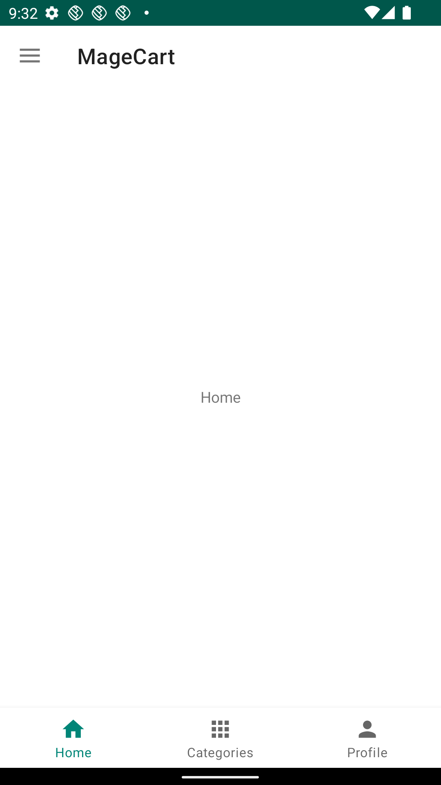

# Android app for Magento 2


[](https://github.com/sanjeevyadavit/magento-android/issues)


E-Commerce App written in Android which consumes [Magento 2 REST api](https://devdocs.magento.com/guides/v2.3/get-started/rest_front.html) to display catalog, products, add products to cart. This project uses Clean MVVM architecture and follow best practices.

## :camera: Screenshots

<div style="display:flex;" >
  
  
  
</div>


## 🚀 Getting Started:

1. Clone the repository, by tying this command in terminal

    ```sh
    git clone https://github.com/sanjeevyadavIT/magento-android.git && cd magento-android

2. Open the repo in Android Studio and build the project


## 🙋‍ Contribute [](http://makeapullrequest.com) 

If you find a bug, or if you have an idea for this app, please file an issue [here](https://github.com/sanjeevyadavit/magento-android/issues). We really appreciate feedback and inputs!

More information on contributing, head over to our [contribution guidelines](CONTRIBUTING.md). 

## 🗃️ Similar project

* [magento_react_native](https://github.com/sanjeevyadavit/magento_react_native) - (REST api)Complete eCommerce app written in React Native for magento 2 using best practices

* [magento_react_native_graphql](https://github.com/sanjeevyadavit/magento_react_native_graphql) - (GraphQL api)Complete eCommerce app written in React Native for magento 2 using best practices

* [magento-react-native-community](https://github.com/troublediehard/magento-react-native-community) - Original project on which this project is based

## ♥️ Donate

If this project help you, or to help acclerate development, you can give me a cup of coffee :smile: :

<a href="https://www.buymeacoffee.com/sanjeevyadavit" target="_blank"></a>

## 🛡 License

This project is licensed under the GNU v3 Public License License - see the [LICENSE.md](LICENSE.md) file for details.